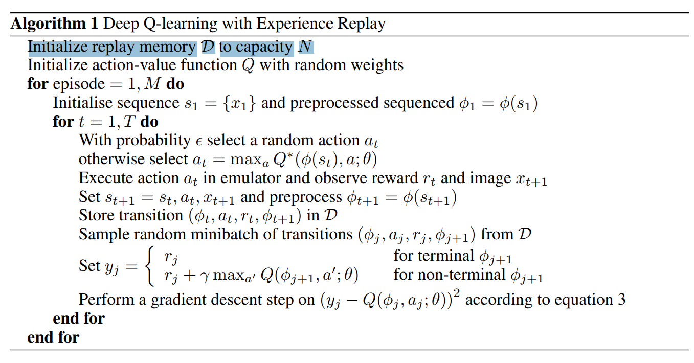

# Unity Environment: Basic

## Index

- [Environment](#environment)
- [Algorithm](#algorithm)
- [Getting Started](#getting-started)
- [Training](#training)
- [Watch trained Agent](#watch-trained-agent)
- [Reference](#reference)

## Environment

A linear movement task where the agent must move left or right to rewarding states. The goal is to move to the most reward state. The environment contains one agent. Benchmark Mean Reward: 0.93

### Reward Function

- -0.01 at each step
- +0.1 for arriving at the suboptimal state.
- +1.0 for arriving at the optimal state.

### Behavior Parameters

- **Vector Observation space:** One variable corresponding to the current state.
- **Vector Action space:** (Discrete) Two possible actions (Move left, move right).
- **Visual Observations:** None

## Algorithm

We'll be using **DQN** to solve the environment.

### DQN

DQN is an extension of Q Learning and is an RL algorithm intended for tasks in which an agent learns an optimal (or near-optimal) behavioral policy by interacting with an environment. Via sequences of **state (s)** , **actions (a)**, **rewards (r)** and **next_state(s')** it employs a (deep) neural network to learn to approximate the state-action function (also known as a Q-function) that maximizes the agent’s future (expected) cumulative reward. When using a nonlinear function approximator, like a neural network, reinforcement learning tends to be unstable. So we'll be adding some features to DQN.

### Replay Buffer

The inclusion of a replay memory that stores experiences, et = (st, at, rt, st+1), at each time step, t, in a data set Dt = {e1, e2, … et}. During learning, mini-batches of experiences, U(D), are randomly sampled to update (i.e., train) the Q-network. The random sampling of the pooled set of experiences removes correlations between observed experiences, thereby smoothing over changes in the distribution of experiences to avoid the agent getting stuck in local minimum or oscillating or diverging from the optimal policy.

### Target Network

This target network is only updated periodically, in contrast to the action-value Q-network that is updated at each time step. We'll be not be updating it periodically instead we'll be doing a soft update on the target network. It provides stability to the target network.

### DQN with Experience Replay

## Getting Started

### Files

- `dqn_agent.py`: Implementation of a DQN-Agent
- `replay_memory.py`: Implementation of a DQN-Agent's replay buffer (memory)
- `model.py`: Implementation of neural network for vector-based DQN learning using PyTorch.
- `env_test.ipynb`: Test if the environment is properly set up or not.
- `train.ipynb`: Train DQN Agent on the environment.
- `test.ipynb`: Test DQN-agent using a trained model and visualize it.

### How to Train

- **Step 1**: First, get started with `env_test.ipynb` to verify that the environment is properly set up.
- **Step 2**: Train DQN Agent using `train.ipynb`.
- **Step 3**: Test DQN-Agent and visualize using `test.ipynb` at different checkpoints. You can also skip **Step 2** and download pre-trained models and place them inside **models** folder.

## Training

### Neural Network

Because the agent learnings from vector data (not pixel data), the Q-Network (local and target network) employed here consisted of just 2 hidden, fully connected layers with 16 nodes. The size of the input layer was equal to the dimension of the state size (i.e., 1 node) and the size of the output layer was equal to the dimension of the action size (i.e., 2).  

### Hyperparameters

- state_size: 1 (One variable corresponding to the current state.)
- action_size: 2 (Two possible actions (Move left, move right))
- replay_memory size: 1e5
- batch_size: 32
- gamma: 0.99
- learning_rate: 1e-3
- Tau: 1e3
- update_every: 5

### Training Parameters

- num_episodes: 2000
- epsilon (float): 1.0
- epsilon_min: 0.01
- epsilon_decay: 0.99
- scores_average_window: 100
- solved_score: 0.93(mean over 100 episodes)

### Performance

## Watch Trained Agent

## Reference

- Mnih, V., Kavukcuoglu, K., Silver, D., Rusu, A. A., Veness, J., Bellemare, M. G., ... & Petersen, S. (2015). Human-Level control through deep reinforcement learning. Nature, 518(7540), 529.
